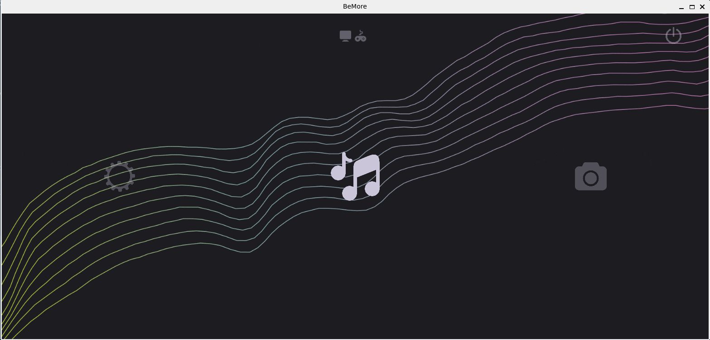
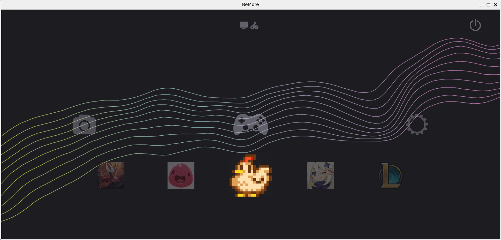
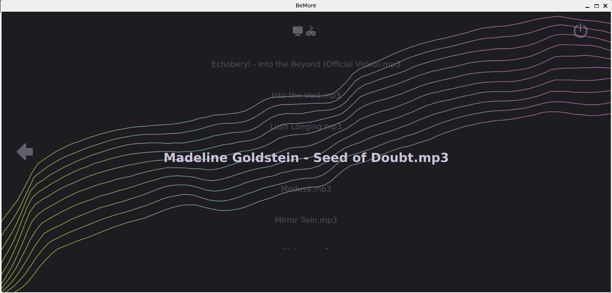

# BeMore GUI

### Graphical User Interface for an original Orange Pi + armbian console
- Qt & C++
- navigating with joysticks and buttons
- clean and responsive horizontal carousel design with multiple levels of depth
- supports switching between desktop and console mode (this GUI)

## Functionalities
- Image gallery binded to the Images/Photos folder, chosen image can be enlarged
- Music (mp3 file) list for browsing (and hopefully playing in the future)
- Settings
- Folder for starting up games
- Console/desktop mode switch
- Battery and time display
- Animated wallpaper

## Gallery
Base view, visible main carousel and options    
    
View with the games folder open     
   
View with the mp3/music folder open    

